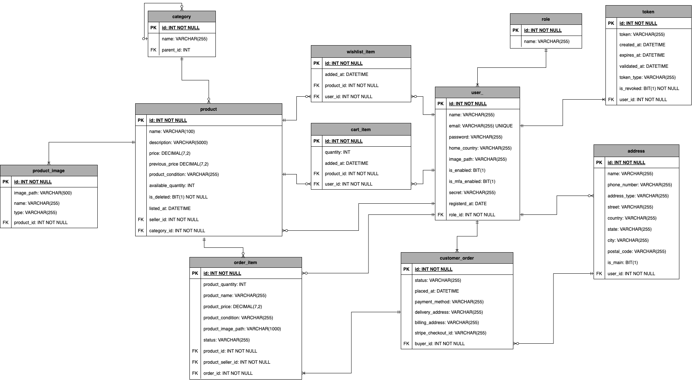

# TopMart

A full-stack e-commerce platform built for buying and selling second-hand goods. Built with Spring Boot, React + TypeScript, and MySQL.

## Features

**Product Management**
- Browse products with pagination, filtering by category, and sorting options
- Add items to cart or save them to your wishlist
- View all products from a specific seller
- List your own items for sale with detailed descriptions, pricing, condition notes, and multiple images
- Edit and manage your active listings

**Order Processing**
- Checkout with items from multiple sellers in a single transaction
- Integrated Stripe payment processing (test mode)
- Automatic email notifications sent to buyers and sellers
- Track your sales and mark items as shipped
- Monitor your purchases and confirm delivery

**User Account**
- Update profile information, including name, avatar, and location
- Optional Multi-Factor Authentication for enhanced security
- Manage multiple shipping addresses

**Admin Dashboard**
- User management: enable/disable accounts and assign admin privileges
- Product moderation: review and toggle product availability
- Category management: create, edit, and remove product categories
- Analytics: track products sold, revenue generated, user registrations, and order volume

## Tech Stack

**Frontend**
- React with TypeScript
- TanStack Query for server state management
- React Router for navigation
- Mantine UI components and data tables

**Backend**
- Spring Boot with Java
- Spring MVC for REST APIs
- Spring Security for authentication and authorization
- Spring Data JPA for database operations
- Flyway for database migrations
- Stripe API integration for payments

**Database**
- MySQL (containerized with Docker)

## Testing Strategy

I've implemented comprehensive testing across multiple layers:

- **Unit Tests**: Service layer logic tested with JUnit, Mockito, and AssertJ
- **Controller Tests**: Web layer tested using @WebMvcTest and MockMvc for isolated endpoint validation
- **Repository Tests**: Database interactions verified with @DataJpaTest and Testcontainers running actual MySQL instances
- **Integration Tests**: Full application testing with @SpringBootTest, TestRestTemplate, and Testcontainers to ensure end-to-end functionality

## Security Implementation

- JWT-based authentication with access and refresh tokens
- Role-Based Access Control separating user and admin permissions
- Email verification required for new account activation
- Optional MFA using time-based one-time passwords

## Deployment

The application is deployed on AWS infrastructure:
- Backend hosted on EC2
- Frontend served from S3
- CloudFront CDN for improved performance and HTTPS
- Custom domain configured through Route 53

## CI/CD Pipeline

Automated workflows using GitHub Actions:
- Run unit tests on every feature branch push
- Execute full test suite (unit + integration) on pull requests
- Automated deployment to production on main branch updates

## Database Schema



## Local Development Setup

**Prerequisites**
- Java 17 or higher
- Node.js 18+
- Docker Desktop
- Stripe account (for payment testing)
- Stripe CLI

**Required Ports**
- 5173 - React development server
- 8080 - Spring Boot API
- 3306 - MySQL database
- 1080 - MailDev SMTP server

**Environment Configuration**

Set your Stripe secret key:
```
STRIPE_SECRET_KEY=your_stripe_secret_key_here
```

**Getting Started**

1. **Configure Stripe Webhooks**

Start the Stripe CLI to forward webhook events:
```bash
stripe listen --forward-to localhost:8080/api/orders/stripe-webhook
```

Copy the webhook signing secret and add it to `backend/src/main/resources/application-dev.yml` under `application.stripe.webhook-secret`

2. **Start Backend Services**

From the project root:
```bash
cd backend
docker compose up -d mysql-topmart mail-dev
./mvnw spring-boot:run
```

3. **Start Frontend**

From the project root:
```bash
cd frontend
npm install
npm run dev
```

4. **Access the Application**

Navigate to http://localhost:5173/auth/login

Test credentials:

| Email | Password | Test Card |
|-------|----------|-----------|
| john@gmail.com | pass123 | 4242 4242 4242 4242 |

**Development Notes**
- Product images won't display in Stripe checkout during local development (HTTP limitation)
- View all sent emails at http://localhost:1080/#/

**Running Tests**

From the project root:
```bash
cd backend
docker compose up -d mail-dev
./mvnw clean verify
```